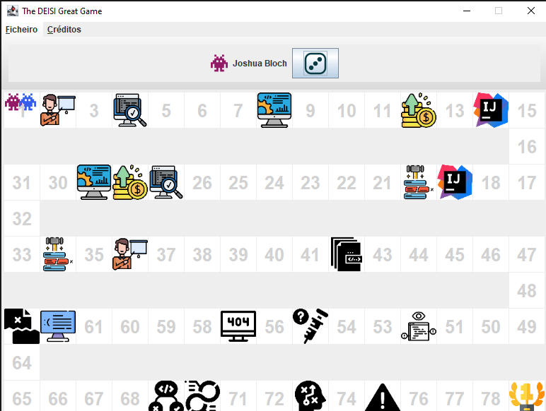

<h1 align="center"> O Grande Jogo do DEISI </h1>

<h2> :pencil: Diagrama UML</h2>

<h4 align="center">Diagrama que descreve a terceira parte do projeto.</h4>

<h2> :speech_balloon: Comentários</h2>

<h4>Para a criação das ferramentas e abismos, decidimos criar 2 funções auxiliares com um return switch (switch mais simplificado) que permite criar as ferramentas através de polimorfismo, já que para a criação das ferramentas e abismos, decidimos utilizar heranças, pois o código fica mais organizado.</h4>
<h4>Para a implementação do efeito do abismo "Ciclo infinito", resolvemos utilizar um HashSet para guardar todos os programadores que se encontram numa certa posição, pois para esta ocasião, o HashSet é mais eficaz.</h4>
<h4>Para a implementação do efeito do abismo "Duplicated Code", optamos por guardar todas as posições numa lista que criámos como atributo no objeto Programmer.</h4>

<h2> :movie_camera:Video com funcionamento do jogo no visualizador</h2>

https://youtu.be/HjwcHQMaDK0

<h2> :file_folder: Tabela com mapeamento entre abismos e ferramentas</h2>

<h2 id="about-the-project"> :black_nib: Desenvolvido por:</h2>

<h4>Tiago Águeda - a22001757</h4>
<h4>João Antas - a22002629</h4>
